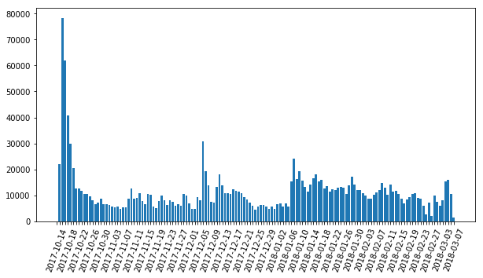
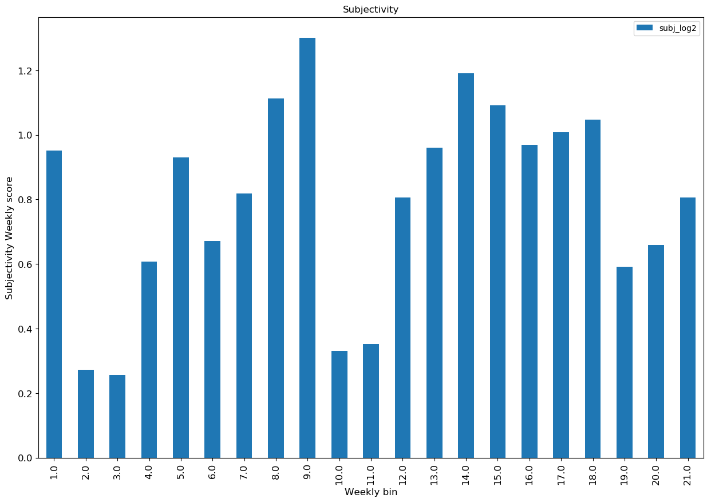
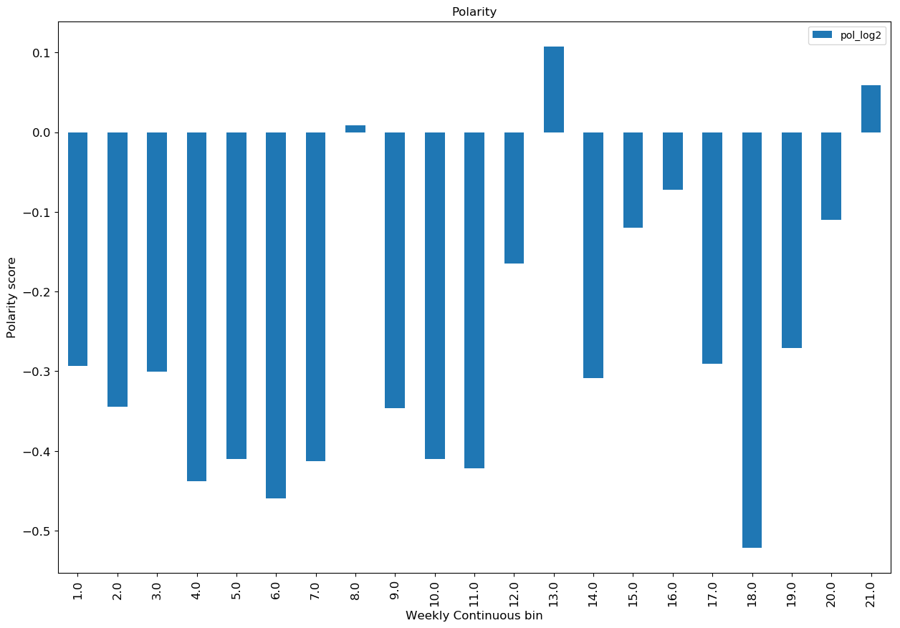
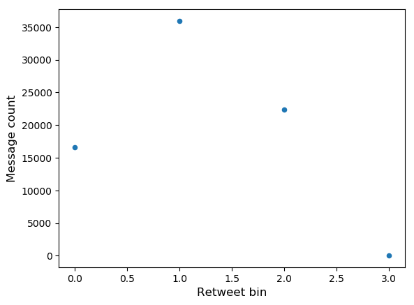

## Introduction

Social media, especially Twitter, in the last decade, has given voices to the social movement with hashtags such as #ArabSpring, #BlackLivesMatter #LoveWins, #JeSuisCharlie and revolutionized how we approach social issues. In this project, we analyze #MeToo tweets to predict real-world outcomes as a direct consequence of sexual harassment that is plaguing the society. As the movement works towards changing perceptions and responses of sexual harassment, the tweets generated to support the movement are enormous with mixed opinions. Analyzing the #MeToo tweets, we found patterns that summarizes the viewpoint over time - negative polarity during an allegation and positive because of actions taken against offenders, along with fluctuating subjectivity which can be reflection of allegations and countenance. The change in subjectivity over time indicates the gravity of the situation and how much people are affected. 
Everyday a lot information is shared through twitter. Analyzing the tweets of this movement, we also intend to discover patterns. By exploring several tweets features we intend to understand what makes a tweet more widely shared than the others. We have gathered the tweets from October 15th, 2017 to March 6th, 2018. We made an explorative data analysis to uncover that tweets text have strong relationships with retweetability. 

This movement which was ongoing for years, gained popularity with Harvey Weinstein’s acts of sexual misconduct revelations and actress Alyssa Milano hashtag encouraging women to tweet their experiences. It serves to raise awareness and has been used for bringing to justice many offenders. Since the introduction of the hashtag, there have been constant tweets by users with intermittent spike following a revelation of an offender or when an offender has been penalized. With tweets classified using a lexicon, we intend to derive the subjectivity and polarity of the sentiments.

We begin the study by extracting tweets from 15th October 2017, when the hashtag gained momentum, to 6th March 2018 and perform data cleansing. For sentiment classification, we segregated the tweets into bi-weekly bins. Then we utilize three lexicons to determine the one that performs a better job of predicting the sentiment. We then calculate the subjectivity and polarity as defined in the paper "Predicting the Future with Social Media"[9] by Sitaram Asur and Bernardo A. Huberman, The Barnaghi, P., Ghaffari, P., & Breslin, J. G. (2016). We then plot to see how the sentiments and polarity have changed over time and the real-world scenario behind such an outcome. Then group the tweets by users to understand the features of tweets, using the methods described in "Want to be Retweeted? Large Scale Analytics on Factors Impacting Retweet in Twitter Network"[10] by Bongwon Suh, Lichan Hong, Peter Pirolli, and Ed H. Chi and "Predicting the Political Alignment of Twitter Users"[11] by Michael D. Conover, Bruno Gonc¸alves, Jacob Ratkiewicz, Alessandro Flammini and Filippo Menczer, that make it popular. 

We discuss the problems encountered in predicting sentiment of the tweet and its popularity, any bias or noise introduced and the factors that influence them. We show that Vader lexicon perform better at predicting a tweets sentiment. For determining retweet rate, a classification problem, we consider the text of the tweets, and user features as described in "Predicting Popular Messages in Twitter"[12] by Liangjie Hong Ovidiu Dan Brian D. Davison. We find that the text has better chance of being predicting retweet rate.

## Dataset description

We collected two datasets for the analysis. As part of content analysis for sentiment classification we gathered tweets scraping the web and collecting approximately 2 million tweets. For the tweet prediction, we have collected 75 thousand tweets using the Twitter API with user features.
Tweets are characterized as short messages with a limit of 140 characters (increased to 280 in September 2017) that serve to provide status update of a user. This length constraint has influenced the use of hashtags, retweets and mentions. They serve to group common messages for an intended audience with a specific topic.

## Sentiment Classification

We perform sentiment classification using a Lexicon and interpret its score to categorize a tweet to positive, negative and neutral. We have used three Lexicons to determine which one works for our dataset. We have used Vader, "VADER: A Parsimonious Rule-based Model for Sentiment Analysis of Social Media Text"[18] by Hutto, C.J. & Gilbert, E.E. (2014), AFinn, developed by Finn Årup Nielsen, "A new ANEW: evaluation of a word list for sentiment analysis in microblogs"[17], and TextBlob[19], a Python (2 and 3) library for processing textual data developed by Steven Loria.

We first look at the classification performed by various lexicons, then move on to calculating subjectivity and polarity.

Using the formula defined in “Predicting the Future with Social Media” [9] by Sitaram Asur and Bernardo A. Huberman, The Barnaghi, P., Ghaffari, P., & Breslin, J. G. (2016). 

We have captured subjectivity and polarity as follows,

Subjectivity = |Positive and Negative Tweets|
               ______________________________
		              |Neutral Tweets|

PNratio = |Tweets with Positive Sentiment|				
          ________________________________
          |Tweets with Negative Sentiment|

Now we use the 10K dataset to analyze the features that make a tweet popular. The initial hypothesis was that more than the content of the features, it would be the number of followers a user has that would make the tweet popular.
We have used the methods described by "Predicting Popular Messages in Twitter"[12] by Liangjie Hong Ovidiu Dan Brian D. Davison and "Want to be Retweeted? Large Scale Analytics on Factors Impacting Retweet in Twitter Network"[10] by Bongwon Suh, Lichan Hong, Peter Pirolli, and Ed H. Chi for our analysis.
For this analysis, we have taken the text of the tweet and grouped them by user. We then bin the retweet into 4 classes: 0: not retweeted, 1: retweet count between 1 to 100, 2: retweet count between 100 to 1000 and 3: retweet count greater than 1000. We then use multiple features to determine the retweet bin for tweet posted. 

## Popularity of a Tweet

We fit logistic regression model with 5-fold cross validation separately on each feature, TF-IDF, LDA and metadata, to determine the retweet rate. The TF-IDF had the highest accuracy of 60% followed by LDA with an accuracy of 51%. The metadata information has an accuracy of 48% same as using only follower’s count to predict retweet.

#### ACCURACY OF CLASSIFICATION TASK
| Methods               | Accuracy  |
|:----------------------|:---------:|
| TF-IDF	              | 0.59      |
| LDA	                  | 0.51      |
| Metadata Information	| 0.48      |
| Followers_Count	      | 0.48      |

## Conclusion

We have analyzed the #MeToo tweets for sentiment classification and predicting retweets. We first used Vader lexicon to classify the tweets as positive, negative and neutral. Then we visualized the subjectivity and polarity. We found that initially more of the tweets were negative as people were coming out with their experiences, hardships. Twitter was stormed with #MeToo as and when a revelation was made about a celebrity. The sentiments were more negative during these times. There are shifts to neutral but rarely there are positive polarity. The last six months have been the most controversial for sexual harassment. It has been shocking to see how many have used their power and position to extract favors from people taking advantage of the other persons helplessness. Even though the papers, "Predicting Popular Messages in Twitter"[12] by Liangjie Hong Ovidiu Dan Brian D. Davison and "Want to be Retweeted? Large Scale Analytics on Factors Impacting Retweet in Twitter Network"[10] by Bongwon Suh, Lichan Hong, Peter Pirolli, and Ed H. Chi, find the number of followers to be a better explanatory variable to predict the retweet rate, we find that for #MeToo the TF-IDF and LDA feature has been more prominent in predicting the retweet rate.

## REFERENCES

[1]	Gerbaudo, P., “Tweets and the streets: social media and contemporary activism.” London: Pluto Press. (2012)
[2]	Lim, M. “Clicks, Cabs, and Coffee Houses: Social Media and Oppositional Movements in Egypt, 2004-2011”. Journal of Communication,62 (2), 231-248. (2012) doi:10.1111/j.1460-2466.2012.01628.x
[3]	Harlow, S. “Social media and social movements: Facebook and an online Guatemalan justice movement that moved offline.” New Media & Society,14 (2), 225-243. (2012) doi:10.1177/1461444811410408
[4]	Youmans, W. L., & York, J. C. “Social Media and the Activist Toolkit: User Agreements, Corporate Interests, and the Information Infrastructure of Modern Social Movements.” Journal of Communication,62 (2), 315-329. (2012) doi:10.1111/j.1460-2466.2012.01636.x
[5]	Barnaghi, P., Ghaffari, P., & Breslin, J. G. “Opinion Mining and Sentiment Polarity on Twitter and Correlation between Events and Sentiment.” 2016 IEEE Second International Conference on Big Data Computing Service and Applications (BigDataService). doi:10.1109/bigdataservice.2016.36
[6]	Bifet, A., & Frank, E. “Sentiment Knowledge Discovery in Twitter Streaming Data.” Discovery Science Lecture Notes in Computer Science, 1-15. (2016) doi:10.1007/978-3-642-16184-1_1
[7]	Sixto, J., Almeida, A., & López-De-Ipiña, D. “An Approach to Subjectivity Detection on Twitter Using the Structured Information.” Computational Collective Intelligence Lecture Notes in Computer Science, 121-130. (2016). doi:10.1007/978-3-319-45243-2_11
[8]	Peetz, M., Rijke, M. D., & Kaptein, R. “Estimating reputation polarity on microblog posts.” Retrieved February 10, 2018, from http://dare.uva.nl/search?metis.record.id=476754
[9]	Asur, S., & Huberman, B. A. “Predicting the Future with Social Media.” 2010. IEEE/WIC/ACM International Conference on Web Intelligence and Intelligent Agent Technology . doi:10.1109/wi-iat.2010.63
[10]	Bongwon Suh, Lichan Hong, Peter Pirolli, and Ed H. Chi “Want to be Retweeted? Large Scale Analytics on Factors Impacting Retweet in Twitter Network” IEEE International Conference on Social Computing / IEEE International Conference on Privacy, Security, Risk and Trust 978-0-7695-4211-9/10 $26.00 © 2010 IEEEDOI 10.1109/SocialCom.2010.33 177
[11]	Michael D. Conover, Bruno Gonc¸alves, Jacob Ratkiewicz, Alessandro Flammini and Filippo Menczer “Predicting the Political Alignment of Twitter Users”
[12]	Liangjie Hong Ovidiu Dan Brian D. Davison "Predicting Popular Messages in Twitter". WWW 2011 – Poster
[13]	Zongyang Ma, Aixin Sun, and Gao Cong "On Predicting the Popularity of Newly Emerging Hashtags in Twitter"
[14]	Shirky, C. “The Political Power of Social Media.” (2016, January 21). Retrieved February 07, 2018, from https://www.foreignaffairs.com/articles/2010-12-20/political-power-social-media 
[15]	Sichynsky, T. “These 10 Twitter hashtags changed the way we talk about social issues.” (2016, March 21). Retrieved February 07, 2018, from https://www.washingtonpost.com/news/the-switch/wp/2016/03/21/these-are-the-10-most-influential-hashtags-in-honor-of-twitters-birthday/?utm_term=.0aaaa2fb9c3c
[16]	Zaman, H. U. (n.d.). “#MeToo and the worldwide reckoning it brought in 2017”. Retrieved February 07, 2018, from https://www.geo.tv/latest/174883-how-2017-toppled-sexual-predators
[17]	Finn Årup Nielsen, "A new ANEW: evaluation of a word list for sentiment analysis in microblogs", Proceedings of the ESWC2011 Workshop on 'Making Sense of Microposts': Big things come in small packages. Volume 718 in CEUR Workshop Proceedings: 93-98. 2011 May. Matthew Rowe, Milan Stankovic, Aba-Sah Dadzie, Mariann Hardey (editors)
[18]	Hutto, C.J. & Gilbert, E.E. (2014). VADER: A Parsimonious Rule-based Model for Sentiment Analysis of Social Media Text. Eighth International Conference on Weblogs and Social Media (ICWSM-14). Ann Arbor, MI, June 2014.
[19]	Textblob Copyright 2013-2017 Steven Loria
